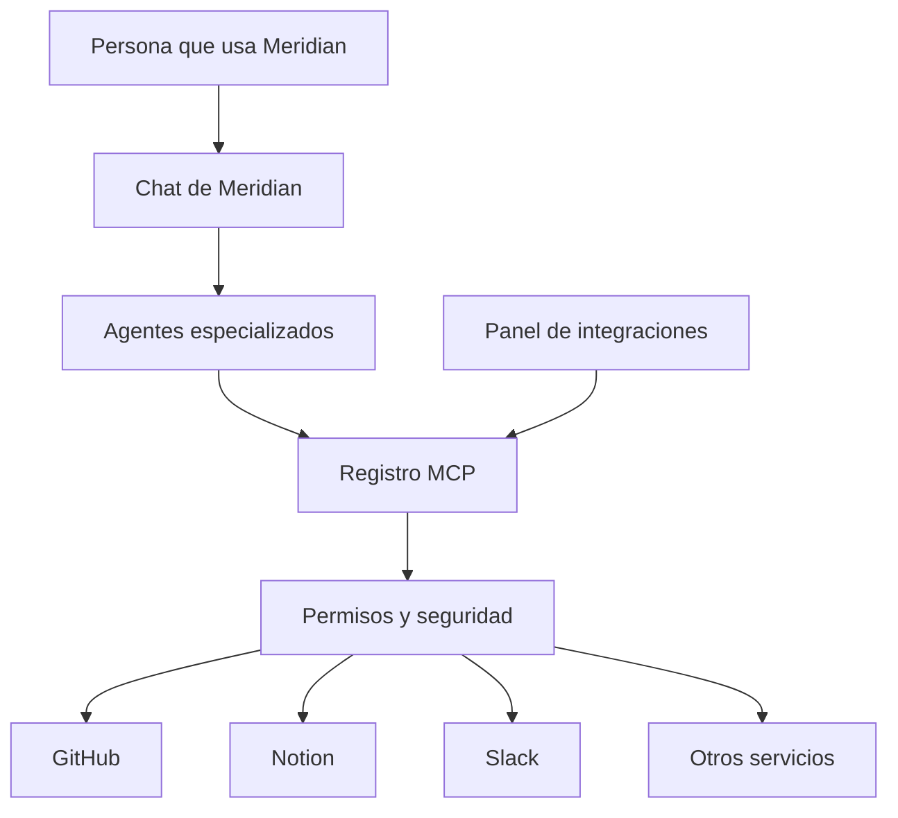
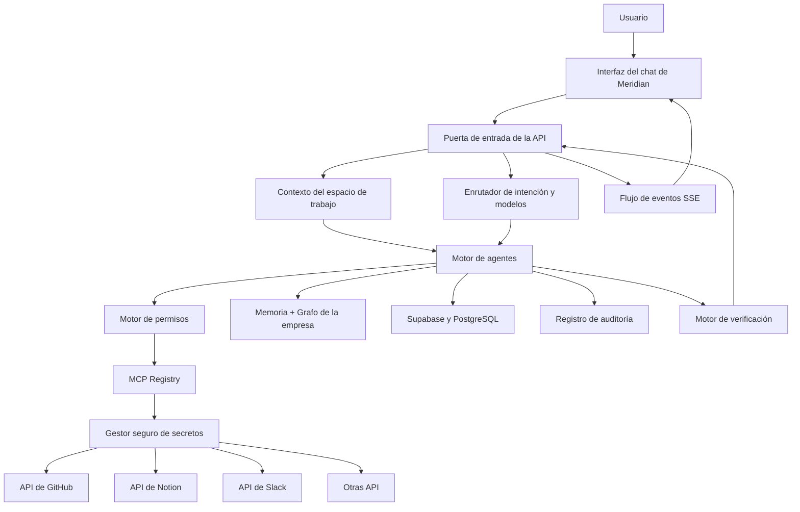
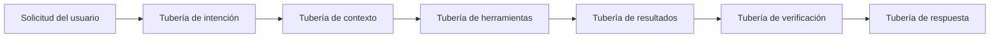
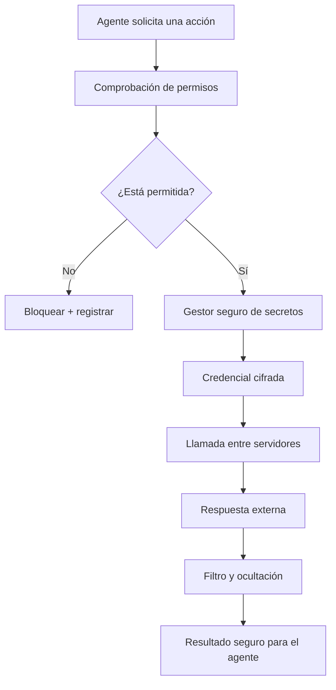
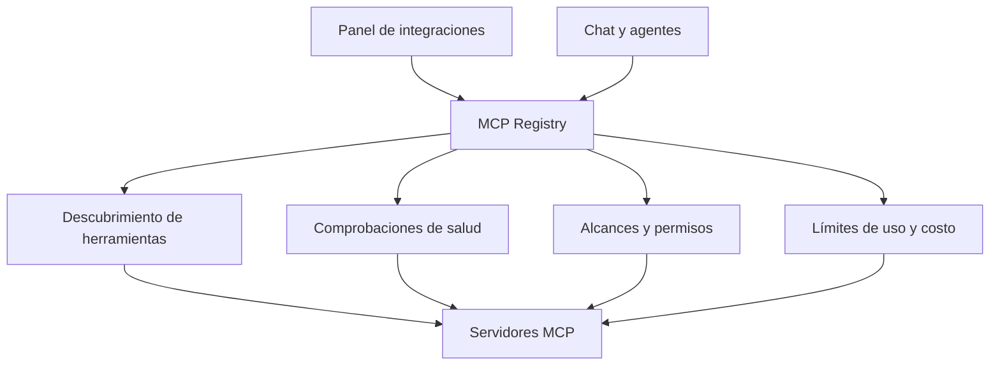
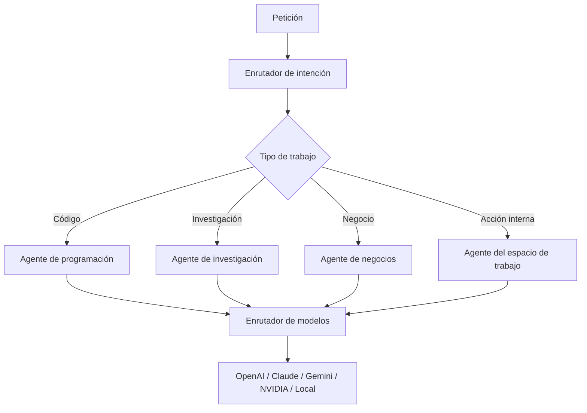
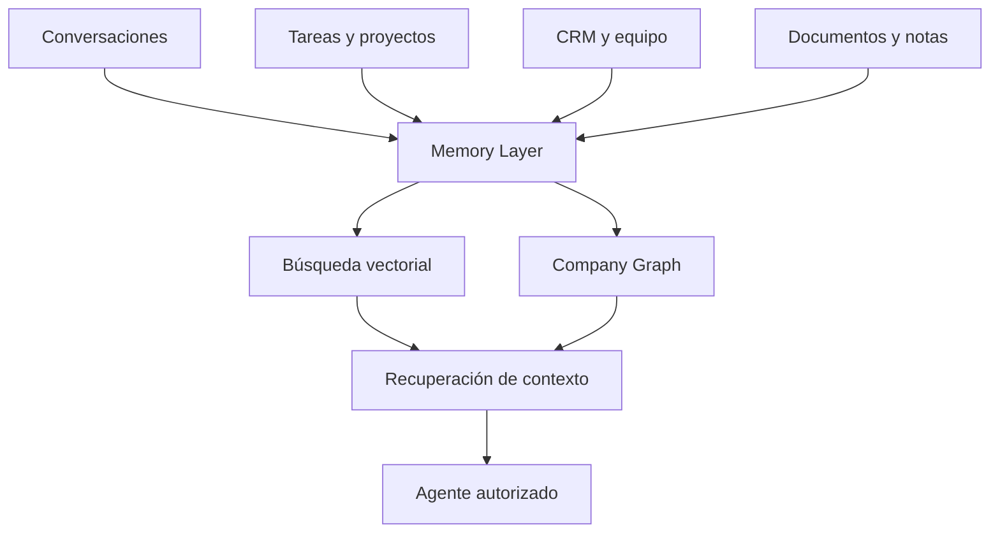
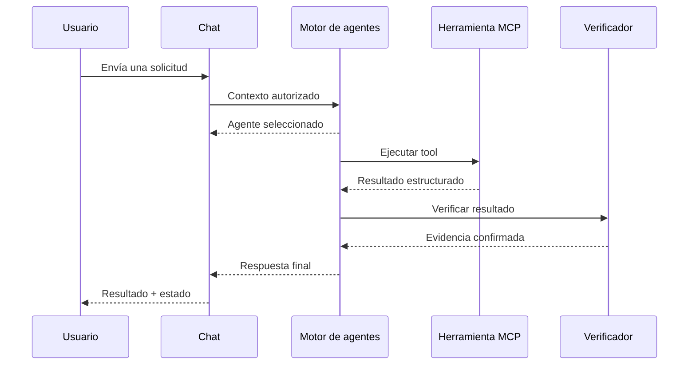
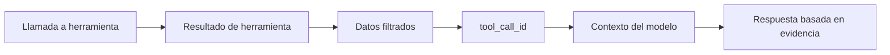
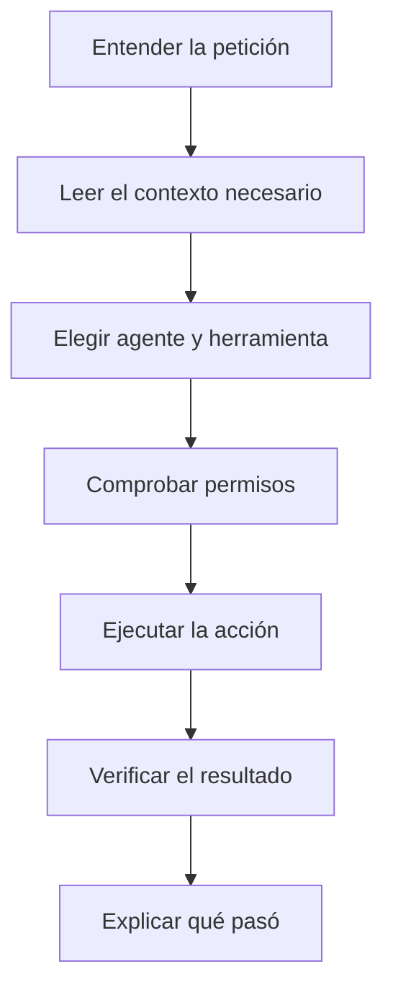

# Cómo entiendo Meridian y cómo pueden ayudarme

Estoy construyendo Meridian porque quiero una herramienta que no se limite a responder preguntas. Quiero que pueda entender lo que estoy haciendo, trabajar conmigo y conectarse con las herramientas que ya uso.

Todavía falta bastante y muchas ideas están en desarrollo. Esta guía es para mis amigos, para las personas que me siguen en GitHub y para cualquiera que tenga curiosidad por el proyecto. Quiero explicar Meridian sin palabras complicadas y dejar claro dónde me pueden ayudar.

## La idea en pocas palabras

Meridian será un espacio de trabajo donde una persona pueda hablar con una IA y pedirle cosas reales: organizar tareas, revisar proyectos, consultar notas, trabajar con el CRM, preparar reuniones o usar servicios como GitHub, Notion y Slack.

El chat es la puerta de entrada, pero no quiero que sea solamente otro chat. Detrás estarán los agentes, el registro de herramientas y los permisos. Cada agente podrá usar únicamente lo que necesite para la tarea.

## El mapa general



Así lo veo yo: la persona habla con Meridian, Meridian entiende la tarea y elige un agente. El agente no entra directamente a ninguna cuenta. Primero pasa por el Registro MCP, que comprueba qué conexión existe, qué permisos tiene y qué acción está permitida.

## Qué hace cada parte

### Chat de Meridian

Es donde explicamos lo que queremos hacer. El chat debe recordar el contexto del workspace y responder con información real, no con datos inventados.

### Agentes especializados

No todos los trabajos deben caer sobre un solo agente. Un agente puede encargarse de tareas, otro del CRM, otro de investigación y otro de integraciones. Meridian debe elegir el indicado y después comprobar el resultado.

### Registro MCP

Para mí, esta es una de las partes más importantes. Es como un centro de control que conoce todas las herramientas conectadas.

El Registro MCP debe poder decir:

- cuáles servicios están conectados;
- cuáles están desactivados o tienen errores;
- qué acciones ofrece cada servicio;
- qué agente tiene permiso para usarlo;
- qué operaciones necesitan confirmación.

El registro puede mostrar nombres, estados, salud y capacidades. Nunca debe mostrar claves, tokens, contraseñas ni variables de entorno.

### Panel de integraciones

Es el lugar donde cada persona conecta y controla sus servicios. Lo que aparece en el panel y lo que conoce el chat deben salir de la misma fuente. No quiero que el panel diga una cosa y el agente diga otra.

### Servicios externos

GitHub, Notion y Slack son ejemplos. Más adelante pueden entrar calendarios, correo, almacenamiento, automatizaciones y otros servidores MCP. La idea es que Meridian pueda crecer sin perder el control.

## El mapa técnico completo

Esta es la parte más técnica de la idea. Yo veo Meridian como un sistema de tuberías. Por una tubería entra la petición, por otras entra el contexto permitido y por otras regresan los resultados. Ninguna conexión debería saltarse los permisos.



La puerta de entrada de la API recibe la solicitud y valida la sesión. El enrutador de intención entiende lo que se quiere hacer. El enrutador de modelos decide qué modelo conviene usar. Después, el motor de agentes prepara el contexto y solamente entrega las herramientas permitidas para esa tarea.

## Las tuberías por dentro

No todas las tuberías transportan lo mismo. Separarlas ayuda a que un error no termine exponiendo información que no debía salir.



- **Tubería de intención:** lleva la intención detectada, el agente elegido y el nivel de confianza.
- **Tubería de contexto:** transporta solamente los datos autorizados del workspace.
- **Tubería de herramientas:** contiene el nombre de la herramienta y los argumentos validados.
- **Tubería de resultados:** devuelve datos estructurados, no un simple `ok`.
- **Tubería de verificación:** vuelve a leer el recurso para confirmar lo que pasó.
- **Tubería de respuesta:** convierte la evidencia en una respuesta que cualquier persona pueda entender.

## Claves de API sin entregárselas al agente

Una clave de API es como una llave privada. Meridian puede necesitarla para abrir una conexión, pero eso no significa que el modelo tenga que verla.



El agente nunca debería ejecutar `printenv`, leer un archivo `.env` o recibir un token dentro del prompt. El `Gestor seguro de secretos` usa la credencial internamente y devuelve solamente el resultado necesario. Antes de regresar al agente, un `Sanitizer` elimina campos como:

```text
apiKey
accessToken
refreshToken
clientSecret
authorization
cookie
password
connectionString
serviceRoleKey
```

## Cómo imagino el Registro MCP

El Registro MCP no es una lista bonita de tarjetas. Debe ser una fuente real de verdad para el chat, los agentes y el panel de integraciones.



Cada conexión debería tener un contrato parecido a este:

```ts
type McpConnectionStatus =
  | "connected"
  | "degraded"
  | "disabled"
  | "configuration_required"
  | "error";

interface PublicMcpConnection {
  id: string;
  name: string;
  provider: string;
  status: McpConnectionStatus;
  salud: "saludy" | "degraded" | "unknown";
  capabilities: string[];
  enabled: boolean;
  requiresApproval: boolean;
}
```

Ese contrato es público para el agente porque no contiene secretos. Los tokens, URLs privadas y credenciales viven en otra capa.

## Los agentes y el enrutador de modelos

Meridian no tiene que usar siempre el mismo modelo. Algunas tareas requieren razonamiento fuerte, otras velocidad, otras visión y otras solamente una consulta a una herramienta.



El router puede comparar capacidad, coste, latencia, privacidad y disponibilidad. Si un proveedor falla, el sistema no debe cambiar de modelo silenciosamente cuando el usuario eligió uno específico. Si el alternativa automática está permitido, debe quedar registrado.

## Memoria y Company Graph

No quiero una memoria que mezcle todo sin control. Meridian debe separar conversaciones, proyectos, decisiones y conocimiento de la empresa.



La búsqueda vectorial ayuda a encontrar información relacionada. El `Company Graph` conserva relaciones: qué proyecto pertenece a qué equipo, qué tarea depende de otra y qué decisión afectó a un cliente. Todo debe estar aislado por `identificador del espacio de trabajo`.

## Lo que debe ver la interfaz mientras trabaja

No quiero esconder todo detrás de una animación que diga “pensando”. La interfaz debe mostrar estados operativos reales sin revelar el razonamiento privado del modelo.



Por SSE o WebSocket pueden viajar eventos pequeños:

```json
{"type":"agent.selected","agent":"integrations"}
{"type":"tool.started","tool":"mcp.list_connections"}
{"type":"tool.completed","success":true,"count":7}
{"type":"verification.completed","passed":true}
{"type":"response.completed"}
```

Eso permite que el usuario vea movimiento real: qué agente entró, qué herramienta se ejecutó y si el resultado fue verificado.

## Regla importante: nunca quedarse solamente con ok

Este fue uno de los problemas que encontré mientras construía Meridian. Una herramienta puede terminar sin lanzar errores y aun así el modelo no recibir los datos. Para mí, `ok: true` significa únicamente que la ejecución terminó. El resultado completo y sanitizado debe viajar por la tubería hasta el modelo.



El `tool_call_id` une cada llamada con su respuesta. Si falta el payload, Meridian no debe inventar ni decir que el registro está vacío. Debe reportar que la evidencia no llegó y marcar la ejecución como incompleta.

## Cómo debería completarse una tarea



No quiero que Meridian diga “listo” solamente porque una herramienta respondió `ok`. Debe leer el resultado, comprobar que la acción ocurrió y explicar lo importante de una manera sencilla.

## Lo que Meridian sí debe conocer

Meridian puede conocer información operativa autorizada del workspace:

- tareas, proyectos, notas y calendario;
- contactos y procesos del CRM;
- miembros y permisos del equipo;
- integraciones y servidores MCP registrados;
- estado, salud y capacidades de cada conexión;
- resultados de las herramientas que realmente ejecutó.

## Lo que Meridian nunca debe ver

Hay límites que para mí no son negociables:

- secretos y contraseñas;
- API keys, tokens y credenciales;
- variables de entorno;
- código fuente privado cuando la tarea no lo requiere;
- datos de otro workspace;
- razonamiento privado o registros internos sensibles.

Una herramienta puede usar una credencial dentro del servidor para completar una acción, pero el agente no necesita ver esa credencial.

## Cómo me pueden ayudar

No hace falta conocer todo Meridian para colaborar. Una persona puede ayudar con una parte pequeña y aun así aportar mucho.

Ahora mismo me interesa recibir ayuda con:

- revisar estos mapas y señalar partes confusas;
- proponer mejores permisos para los agentes;
- pensar casos donde una integración puede fallar;
- diseñar pruebas para confirmar que un agente no inventa resultados;
- mejorar la documentación en español;
- crear prototipos pequeños y verificables;
- comparar herramientas y librerías actuales;
- revisar accesibilidad y experiencia de usuario;
- abrir issues claros con un problema y una posible solución.

Si alguien quiere colaborar, puede empezar abriendo un issue. No espero que llegue con todo resuelto. Una buena pregunta, una prueba que falta o una explicación más clara también ayuda.

Esta invitación es para [Alberto Martínez](https://github.com/AlbertoMartinez22), para las personas que ya me siguen y para quienes encuentren este proyecto más adelante. Llegar a 12 seguidores puede parecer poco para algunos, pero para mí es un logro porque significa que más personas están comenzando a mirar lo que estoy construyendo.

## Lo que quiero conseguir

Quiero que Meridian llegue a ser un compañero de trabajo de verdad: que investigue antes de responder cuando sea necesario, que utilice herramientas reales, que respete los permisos y que termine las tareas con evidencia.

No estoy diciendo que todo esto ya está terminado. Estoy construyéndolo paso a paso, aprendiendo y corrigiendo cosas mientras avanzo. Lo importante es que la dirección está clara.

Si esta idea te interesa, puedes revisar el repositorio, abrir un issue o proponer una mejora. Yo voy a seguir trabajando en Meridian.
